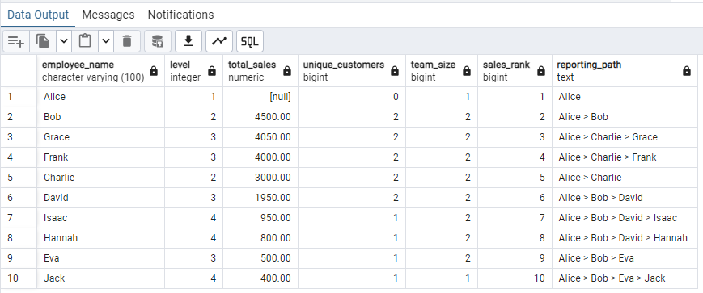

# SQL: Employee Sales Hierarchy Report
## Explanation of Available Tables:
### 1. employees Table:
This table contains information about the employees in the organization. It allows us to know who works where, and who reports to whom.
Columns:
* employee_id: A unique identifier for each employee.
* employee_name: The name of the employee.
* manager_id: The employee ID of the employee's manager. A NULL value indicates a top-level manager (i.e., the employee has no manager).
### 2. sales Table:
This table stores the sales information. Each sale is linked to a specific employee (sales representative).
Columns:
* sales_rep_id: The ID of the employee who made the sale (links to employee_id in the employees table).
* amount: The value of the sale.
* customer_id: A unique identifier for the customer involved in the transaction.
## Question:
### Write a query to generate a hierarchical report of employees, including:
* The employee's name.
* The total sales made by the employee.
* The number of unique customers the employee has interacted with.
* The size of the team each employee manages (if applicable).
* The employee's rank based on total sales within the company.
* The reporting path for each employee, showing all the managers they report to.
* The report should:
### Show the hierarchy of employees, starting from the top-level managers.
* Include recursive calculation to determine which employees report to which managers.
* Include aggregates for each employee such as total sales and unique customers.
  
## Result (Query)
```sql
WITH RECURSIVE recursive_tree AS (
    SELECT 
        employee_id, 
        employee_name, 
        manager_id, 
        1 AS level,
        ARRAY[employee_id] AS path
    FROM employees
    WHERE manager_id IS NULL
    UNION ALL
    SELECT 
        e.employee_id, 
        e.employee_name, 
        e.manager_id, 
        t.level + 1,
        t.path || e.employee_id
    FROM employees e
    JOIN recursive_tree t ON e.manager_id = t.employee_id
    WHERE NOT e.employee_id = ANY(t.path)
), 
sales_aggregate AS (
    SELECT 
        e.employee_id, 
        SUM(s.amount) AS total_sales,
        COUNT(DISTINCT s.customer_id) AS unique_customers
    FROM employees e
    LEFT JOIN sales s ON e.employee_id = s.sales_rep_id
    GROUP BY e.employee_id
), 
final_report AS (
    SELECT 
        t.employee_id, 
        t.employee_name, 
        t.manager_id, 
        t.level,
        sa.total_sales,
        sa.unique_customers,
        COUNT(*) OVER (PARTITION BY t.manager_id) AS team_size,
        DENSE_RANK() OVER (ORDER BY sa.total_sales DESC) AS sales_rank,
        t.path
    FROM recursive_tree t
    LEFT JOIN sales_aggregate sa ON t.employee_id = sa.employee_id
)
SELECT 
    f.employee_name, 
    f.level,
    f.total_sales, 
    f.unique_customers, 
    f.team_size,
    f.sales_rank,
    STRING_AGG(p.employee_name, ' > ' ORDER BY p.level) AS reporting_path
FROM final_report f
JOIN recursive_tree p ON p.employee_id = ANY(f.path)
GROUP BY f.employee_id, f.employee_name, f.level, f.total_sales, f.unique_customers, f.team_size, f.sales_rank
ORDER BY f.sales_rank, f.level;
```
### Result

